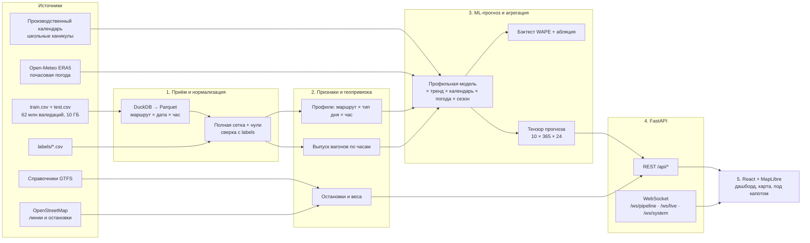

# TramFlow — ИИ-прогноз загрузки трамвайных маршрутов Москвы

Веб-сервис для диспетчеров ЕДЦ: прогноз посадок **маршрут × дата × час** на горизонты день / месяц / год,
агрегация по маршруту, остановке и интервалу, карта Москвы с динамикой загрузки, корректирующие коэффициенты,
выгрузка CSV/XLSX и прозрачный «под капотом» — конвейер обработки данных виден в реальном времени.

| | |
|---|---|
| Качество (бэктест, 5 окон, WAPE-score) | **0.887** (baseline организаторов 0.48, «потолок» постановки ≈ 0.93) |
| Производительность (1 контейнер, 2 vCPU / 2 ГБ) | **~1 880 RPS, p95 46 мс** на смешанной нагрузке без кэша; 3 400 RPS, p95 20 мс с кэшем |
| Полная пересборка модели | ≈ 1 с (из кэша агрегатов), ≈ 17 с из сырых 10 ГБ CSV |
| Стек | Python 3.13 · DuckDB · pandas/numpy · LightGBM (эксперимент) · FastAPI + WebSocket · React 19 + TypeScript · MapLibre · Recharts · Docker Compose |

---

## 1. Быстрый старт (для жюри)

```bash
# 1) распакуйте dataset.zip рядом с проектом:  ../dataset/{labels,spravochniki,train.csv,test.csv}
# 2) запуск
DATASET_DIR=../dataset docker compose up --build
# 3) открыть
open http://localhost:8080          # веб-интерфейс
open http://localhost:8000/docs     # Swagger / OpenAPI
```

* Сервис стартует **без сети и без сырых CSV**: в образ зашиты кэш агрегатов 10 ГБ валидаций (`data/raw_hourly.parquet`, 0.9 МБ),
  погода и геометрия OSM. Нужны только `labels/*.csv` и `spravochniki/` из `dataset.zip`.
* Если сырые `train.csv`/`test.csv` смонтированы — кнопка **«Пересчитать из сырых (10 ГБ)»** на экране «Под капотом»
  прогоняет DuckDB-агрегацию заново (~17 с) с прогрессом по WebSocket.
* `submission.csv` для платформы: `GET /api/submission` или кнопка на экране «Прогноз и выгрузка».

### Без Docker (разработка)

```bash
python3 -m venv .venv && .venv/bin/pip install -r backend/requirements.txt   # macOS: brew install libomp (для LightGBM)
cd backend && ../.venv/bin/uvicorn app.main:app --port 8000                  # API
cd frontend && npm install && npm run dev                                    # UI → http://localhost:5173
```

### Воспроизведение сабмита

```bash
cd backend
../.venv/bin/python -m app.cli                    # конвейер → data/submission.csv (14 640 строк)
../.venv/bin/python -m app.cli --force-raw        # то же, но с пересчётом агрегатов из сырых 10 ГБ
../.venv/bin/python -m app.cli --scale 1.02 --out ../submissions/s102.csv   # вариант с поправкой уровня
```

---

## 2. Архитектура



| Модуль | Файл | Назначение |
|---|---|---|
| Приём сырых данных | `backend/app/ml/aggregate_raw.py` | DuckDB читает 10 ГБ CSV, сворачивает в почасовые агрегаты (посадки, отказы, уникальные карты, вагоны, тарифы) |
| Календарь | `backend/app/ml/calendar.py` | Праздники/переносы РФ 2025–2026, школьные каникулы Москвы, особые дни |
| Погода | `backend/app/ml/weather.py` | Open-Meteo Historical API, почасовые и дневные признаки |
| Геопривязка | `backend/app/ml/geo.py` | Остановки из справочников + OSM, веса остановок |
| Модель | `backend/app/ml/model.py` | Профильная мультипликативная модель, WAPE-score |
| Конвейер | `backend/app/pipeline.py` | 9 стадий, события в шину → WebSocket |
| Хранилище | `backend/app/store.py` | Тензоры прогноза, агрегации, коэффициенты, экспорт |
| API | `backend/app/main.py` | REST + 3 WebSocket, обработка ошибок, метрики латентности |
| UI | `frontend/src/pages/*` | Обзор · Карта · Прогноз и выгрузка · Под капотом · Модель · Сервис и API |

---

## 3. Данные и конвейер

1. **Приём** — DuckDB параллельно читает `train.csv` + `test.csv` (10.4 ГБ, 62.4 млн строк) за ~17 с и пишет `raw_hourly.parquet`.
   Время события — `tran_date_time` (`input_date_time` ненадёжно), маршрут — `ngpt_route`, посадка — `validation_result = 1`.
2. **Нормализация** — полная сетка 10 маршрутов × 304 дня × 24 часа (72 960 ячеек, дозаполнено 15 409 нулей).
   Сверка сырых агрегатов с `labels`: расхождение **1 посадка из 59 667 191**.
   Маршрут 5 — 0 посадок за 10 месяцев → прогноз 0.
3. **Внешние данные** — календарь, погода, OSM (кэшируются в `data/`).
4. **Геопривязка** — 292 остановки, 1 393 сегмента линий.
5. **Признаки** — профили, выпуск вагонов по часам (медиана 6 недель), норматив посадок на вагон (p95 по маршруту).
6. **Бэктест** — 5 окон × 4 варианта модели.
7. **Обучение** — финальная модель на 28 днях до 31.10.2025.
8. **Прогноз** — 01.11.2025 … 31.10.2026 по часам с разложением на компоненты.
9. **Экспорт** — `submission.csv`, `forecast_components.parquet`.

Статистика сырых данных: отказов валидации 4.45%, проездные 39%, кошелёк 15%, СКМ 36%.

---

## 4. Модель

```
ŷ(route, date, hour) = P[route, класс дня, hour]        профиль: усечённое среднее за 28 дней до точки прогноза
                     × trend[route]                     последние 5 рабочих дней вне каникул / окно
                     × calendar[date]                   праздники → воскресный профиль × множитель; 01.11 рабочая суббота;
                                                        29–30.12 предновогодние; 31.12 — вечер ×0.55
                     × weather[date]                    сильные осадки (> 6 мм/день) → ×0.974
                     × season[month] × event            для горизонта «год» и сценариев из UI
```

Классы дня: пн / вт–чт / пт / сб / вс+праздники. Цель метрики — WAPE, поэтому профиль строится робастно
(усечённое среднее 20%), а ошибка доминирует в дневных и пиковых часах крупных маршрутов.

### Бэктест (WAPE-score, скользящее окно, данные после точки прогноза не используются)

| Окно | Полная модель | Без погоды | Без календаря | Без тренда |
|---|---:|---:|---:|---:|
| 2 недели: 16–31 октября | **0.9168** | 0.9156 | 0.9168 | 0.9156 |
| 1 месяц: октябрь | **0.9031** | 0.9036 | 0.9031 | 0.9040 |
| 1,5 месяца: 15.09–31.10 | **0.8888** | 0.8892 | 0.8888 | 0.8668 |
| 2 месяца: апрель–май (майские праздники) | **0.8503** | 0.8503 | 0.8485 | 0.8500 |
| 2 месяца: март–апрель | **0.8771** | 0.8771 | 0.8771 | 0.8731 |
| **Среднее** | **0.8872** | 0.8872 | 0.8869 | 0.8819 |

* «Оракул» (профиль, подобранный на самом октябре) даёт 0.929 — это потолок постановки по часовому шуму.
* **Что пробовали и отвергли** (честно):
  * LightGBM-корректор остатков (цель y/ŷ, вес ŷ, L1 = прямая оптимизация WAPE; признаки — часовая погода, календарь, час, маршрут):
    ухудшает бэктест 0.8875 → 0.864–0.878. Причина — в остатках обучающих окон доминирует сезонный дрейф (летний спад),
    деревья приписывают его погоде/календарю.
  * 7 классов дня вместо 5: 0.8796 (хуже). Смесь окон 21+42 дня: 0.8810. Дневной погодный множитель по всем корзинам осадков: 0.8834.
  * Учёт недели осенних каникул (27–31.10) в тренде: без исключения тренд занижал ноябрь на 3–5% на маршрутах 1, 7, 25, 28.

---

## 5. Внешние источники (со ссылками и подтверждённым эффектом)

| Источник | Что даёт | Ссылка / способ получения | Эффект |
|---|---|---|---|
| **Производственный календарь РФ 2025/2026** | праздники, переносы (01.11 — рабочая суббота, 03–04.11, 31.12), предпраздничные дни | https://www.consultant.ru/law/ref/calendar/proizvodstvennye/2025/ · https://www.consultant.ru/law/ref/calendar/proizvodstvennye/2026/ · машиночитаемо: https://xmlcalendar.ru/data/ru/2025/calendar.json | окно апрель–май: +0.0018 WAPE-score; праздник = 0.97–1.08 воскресенья (оценено на мае/июне) |
| **Школьные каникулы Москвы** | исключение каникулярных недель из тренда | https://www.mos.ru/otvet-obrazovanie/kogda-kanikuly-v-shkolah-moskvy/ | без него тренд на ноябрь занижен на 3–5% (неделя 27–31.10) |
| **Погода: Open-Meteo Historical (ERA5)** | почасовая температура, осадки, снег, ветер | https://open-meteo.com/en/docs/historical-weather-api · запрос: `https://archive-api.open-meteo.com/v1/archive?latitude=55.7558&longitude=37.6173&start_date=2025-01-01&end_date=2025-12-31&hourly=temperature_2m,precipitation,snowfall,...` | на остатках к скользящей медиане: день с осадками > 6 мм = **−10%** посадок, сухой день +3%. На бэктесте часовой WAPE — нейтрально (+0.0001), поэтому в модели оставлен только эффект сильных осадков с коэффициентом доверия 0.5 |
| **OpenStreetMap (Overpass API)** | линии и остановки маршрутов 17, 25, 26, 28, 50 (нет в справочниках) | https://wiki.openstreetmap.org/wiki/Overpass_API · зеркало https://maps.mail.ru/osm/tools/overpass/api/interpreter | геопривязка 5 маршрутов из 10 |
| **OpenFreeMap** | векторная подложка карты (стиль positron) | https://openfreemap.org | UI |
| **Официальная схема трамвайных маршрутов Москвы** | цвета маршрутов | https://transport.mos.ru | UI |

Все загрузки кэшируются в `data/` и воспроизводятся функциями `fetch*()` в `backend/app/ml/*.py`.

---

## 6. Функциональность

* **Пульт оператора (главный экран):** на весь экран — схема трамвайных маршрутов в официальных цветах «Транспорта Москвы»
  поверх светлой карты (OpenFreeMap), карта ограничена Москвой. На общих участках пути линии идут параллельным «пучком»,
  как на официальной схеме (1 050 отрезков путей OSM, из них 312 общих для 2–3 маршрутов), номера маршрутов подписаны на линиях.
  Сверху по центру — шкала времени: дата, ползунок суток с «тепловой полосой», проигрывание ×1…×8 и индикатор
  «⚠ N перегр. · M вним.» с выпадающим списком проблемных веток. Проблемные ветки на карте светятся (перегрузка > 120%
  норматива — пульсирующий красный, внимание 100–120% — оранжевый) и получают бейдж «№26 · 129%».
  Клик по ветке (на карте, в списке или в нижней панели номеров) — слева на всю высоту выезжает карточка маршрута, карта
  плавно перелетает так, что ветка оказывается в центре видимой области: загрузка сейчас, рекомендация (+N вагонов в окне),
  суточный график посадок против провозной нормы, проблемные окна дня, остановки с наибольшими посадками, причины прогноза,
  выгрузка. Разделы (сводка, прогноз и выгрузка, под капотом, модель, API) — через единственную кнопку меню, которая
  разворачивает меню сверху на всю ширину. Горячие клавиши: ← → час, пробел — пуск/пауза, Esc — сброс.
* **Горизонты:** день (по часам), месяц (по дням), год (по месяцам, сценарный).
* **Агрегация:** маршрут(ы), остановка, диапазон часов, интервал дат; агрегация по часу / дню / месяцу / профилю суток / дню недели.
* **Карта Москвы:** линии и остановки всех 10 маршрутов, цвет — загрузка к нормативу, толщина — посадки,
  подписи самых загруженных остановок выбранной ветки. Сутки загружаются одним запросом `/api/day`, поэтому ползунок
  времени работает мгновенно. Серверная симуляция суток также доступна по WebSocket `/ws/live`.
* **Корректирующие коэффициенты** (погода, событие/перекрытие, сезон, тренд, праздники) — прогноз, карта и рекомендации
  пересчитываются сразу (≈ 0.4 мс на сервере).
* **Разложение прогноза** («водопад»): профиль → тренд → календарь → погода → итог, с погодой и типом дня.
* **Рекомендации по выпуску:** часы, где посадок на вагон больше норматива (p95 истории), и сколько вагонов добавить.
* **Выгрузка:** CSV / XLSX (лист по часам с компонентами + лист по дням), `submission.csv`.
* **Под капотом:** 9 стадий конвейера с прогрессом, метриками и длительностью, живой журнал, запуск из UI,
  пересчёт из сырых 10 ГБ, статистика данных, схема архитектуры.
* **Модель и качество:** бэктест факт/прогноз, абляция источников, WAPE по маршрутам, тепловая карта профиля,
  множители погоды/календаря/тренда, сезонный индекс, область применимости.
* **Сервис и API:** RPS / p50 / p95 / CPU / RAM в реальном времени (`/ws/system`), нагрузочный тест из браузера, список эндпоинтов.

### API (основное)

| Метод | Путь | Описание |
|---|---|---|
| GET | `/api/forecast?horizon=day&date=2025-11-12&route=17` | прогноз по часам |
| GET | `/api/forecast?horizon=month&month=2025-12&by_route=true&weather=1.5` | месяц по дням, по маршрутам, с коэффициентом |
| GET | `/api/forecast?date_from=2025-11-01&date_to=2025-12-31&stop_id=2594&hour_from=7&hour_to=10&agg=day` | остановка, утренний пик |
| GET | `/api/forecast/export?format=xlsx&horizon=month&month=2025-11` | выгрузка |
| GET | `/api/day?date=2025-11-12` | сутки целиком: посадки, вагоны, загрузка, дефицит вагонов по маршрутам × 24 ч (для пульта) |
| GET | `/api/load?date=2025-11-12&hour=8` | загрузка маршрутов на час |
| GET | `/api/recommendations?date=2025-11-12` | перегруженные часы и +вагоны |
| GET | `/api/decompose?route=17&date=2025-12-31` | компоненты прогноза |
| GET | `/api/model`, `/api/meta`, `/api/geo`, `/api/history`, `/api/submission`, `/api/system` | справочная информация |
| POST | `/api/pipeline/run?force_raw=false` | перезапуск конвейера |
| WS | `/ws/pipeline`, `/ws/live`, `/ws/system` | события конвейера, симуляция суток, метрики |

Ошибки — HTTP 400/409/503 с понятным сообщением на русском (`{"error": "Прогноз доступен на период 2025-11-01 … 2026-10-31"}`).

---

## 7. Производительность

Замеры: MacBook (Apple Silicon), Docker Desktop, контейнер backend ограничен **2 vCPU / 2 ГБ** (`docker-compose.yml`), 1 процесс uvicorn (uvloop + httptools).

| Сценарий | Инструмент | RPS | p50 | p95 | p99 | Ошибки | CPU / RAM контейнера |
|---|---|---:|---:|---:|---:|---:|---|
| Смешанная нагрузка без кэша: day/month/year/load/recommendations со случайными датами, маршрутами и коэффициентами, 64 соединения | `scripts/loadtest.py` ×4 процесса | **~1 880** | 32 мс | **46 мс** | 72 мс | 0 | ~100% (1 из 2 ядер), **~440 МБ, стабильно** |
| `/api/forecast` (кэш), 64 соединения | `hey -z 20s -c 64` | **3 436** | 18 мс | 20 мс | 52 мс | 0 | — |
| `/api/load` (карта), 64 соединения | `hey -z 10s -c 64` | **2 291** | — | 32 мс | 66 мс | 0 | — |

Почему быстро: прогноз хранится в тензоре `[10 маршрутов × 365 дней × 24 часа]` для каждой компоненты,
запрос — срез numpy и перемножение с коэффициентами (≈ 0.4 мс), LRU-кэш ответов, orjson, gzip.
Процесс занимает одно ядро (GIL) — второе остаётся в запасе.

**Горизонтальное масштабирование:** сервис без состояния — каждая реплика детерминированно собирает модель за ~1 с при старте
из одних и тех же входных данных; достаточно поставить N реплик за балансировщиком (`docker compose up --scale backend=N`
+ nginx upstream). Для WebSocket конвейера нужен sticky-session или вынос шины событий в Redis Pub/Sub.

Повторить: `hey -z 20s -c 64 "http://localhost:8000/api/forecast?horizon=day&date=2025-11-12&route=17"` и
`python scripts/loadtest.py --duration 25 --concurrency 16 --cache-friendly 0` (4 параллельных процесса).

---

## 8. Область определения, адаптация, ограничения

**Область определения (где модель валидна)**
* 9 активных маршрутов (1, 7, 11, 12, 17, 25, 26, 28, 50) на уровне маршрут × час; маршрут 5 в истории пуст → 0.
* Горизонт 1–2 месяца от последних данных: WAPE-score 0.85–0.92 на бэктесте (чем ближе, тем точнее).
* Режим работы сети стабилен (нет крупных ремонтов). Июльский ремонт на №7 (−58%) модель не предсказала бы — такие события задаются коэффициентом «Событие».

**Зависимости от внешних данных:** календарь (обязательно — праздники ломают недельный цикл), погода (слабая),
выпуск вагонов (для индекса загрузки и рекомендаций).

**Область адаптации**
* Новый период: обновить календарь и погоду, подать свежие валидации — пересборка ≈ 1 с (или 17 с из сырых).
* Новый маршрут: нужно ≥ 4 недель валидаций для профиля. Без истории — профиль похожего маршрута × отношение выпуска вагонов.
* Горизонт «год» — сценарный: сезонный индекс получен по 10 месяцам 2025 (одна реализация сезона); ноябрь–декабрь приняты равными октябрю
  (по аналогии с февралём–мартом 2025, будни которых на уровне октября ±4%).

**Ограничения**
* В валидациях нет остановки посадки → разбивка по остановкам **оценочная** (веса: пересадочные узлы ×2.5, конечные ×1.8).
* Посадки ≠ пассажиры в салоне: безбилетники и выходы не видны; индекс загрузки — отношение посадок на вагон к нормативу (p95 истории маршрута).
* Нет данных за ноябрь–декабрь прошлых лет — предновогодние множители (29–31.12) заданы экспертно.
* Погода на будущее: в сабмите использован фактический архив Open-Meteo за ноябрь–декабрь 2025; в продакшене — прогноз погоды (тот же API, эндпоинт forecast).

---

## 9. Бизнес-ценность

* **Распределение подвижного состава:** экран «Где не хватает вагонов» показывает часы, где посадок на вагон больше p95 истории,
  и сколько вагонов добавить (например, 12.11.2025 в 8:00 на №26 прогноз 172 посадки на вагон при нормативе 120 → +6 вагонов к 13 на линии; всего 38 перегруженных часов·маршрутов за день).
* **Снижение переполнения:** карта загрузки по времени суток подсвечивает участки и часы с риском переполнения.
* **Уточнение расписания:** профиль по часам и дням недели → интервалы движения под спрос (пятница вечером, выходные, праздники 03–04.11, 31.12).
* **Оптимизация эксплуатации:** в провальные часы (выходные, праздники, поздний вечер) видно избыточный выпуск.
* **Сценарный анализ:** коэффициенты «событие/перекрытие», «погода», «сезон» — оценка эффекта до принятия решения.

---

## 10. План развития

1. Остановочная детализация по GPS-треку вагона (`garage_number` + время валидации → ближайшая остановка) — вместо весовой модели.
2. Онлайн-приём потоков валидаций (Kafka) и пересчёт краткосрочного прогноза каждый час; ClickHouse для истории.
3. Прогноз погоды и данные о перекрытиях/ремонтах (data.mos.ru) как автоматические корректирующие коэффициенты.
4. Иерархическая согласованность прогноза (остановка → маршрут → сеть) и вероятностные интервалы (квантильная регрессия).
5. После накопления ≥ 2 лет истории — годовая сезонность из данных, глобальная модель (LightGBM/TFT) по всем маршрутам и видам НГПТ.

---

## Структура репозитория

```
tramflow/
├── backend/            FastAPI + ML (app/ml/*), Dockerfile, requirements.txt
├── frontend/           React 19 + TS + MapLibre, Dockerfile, nginx.conf
├── data/               кэш: агрегаты сырых данных, погода, OSM; submission.csv
├── scripts/loadtest.py нагрузочный тест
├── submissions/        варианты сабмита
└── docker-compose.yml
```
