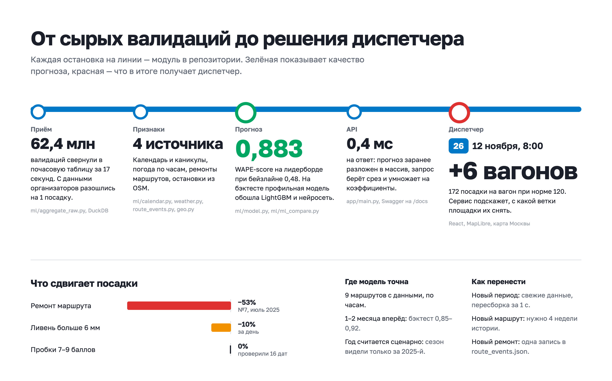
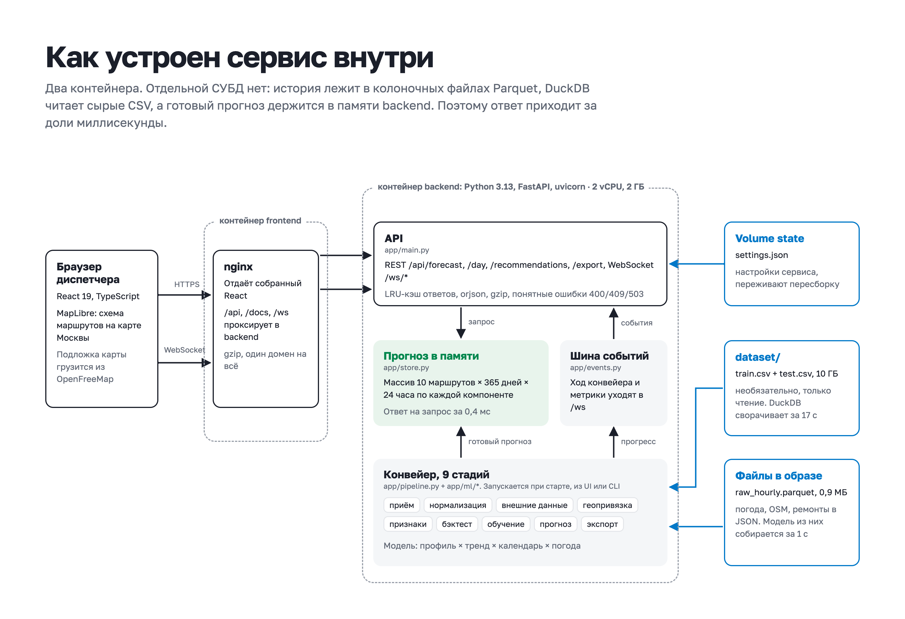
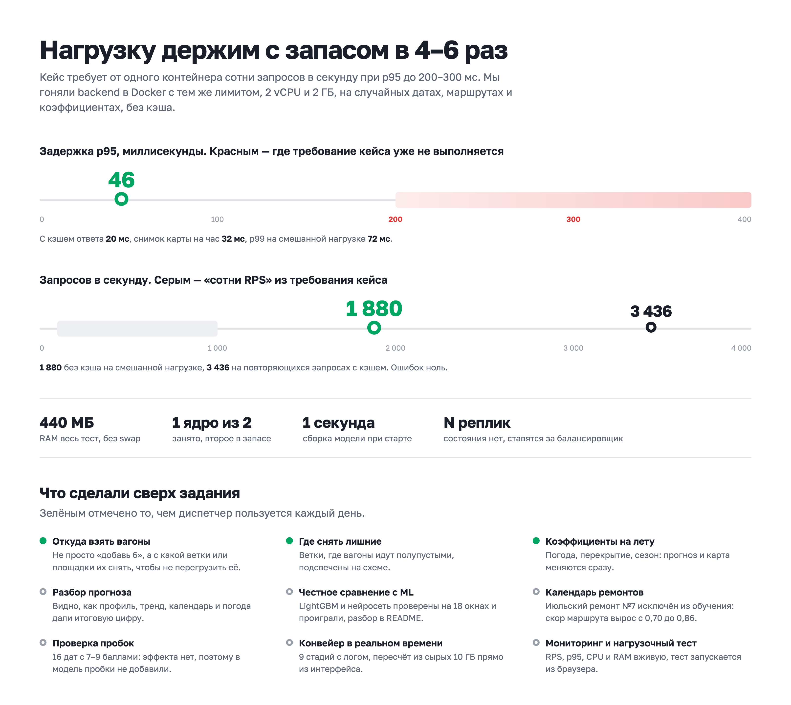

# TramFlow: прогноз загрузки трамваев Москвы

**Работающий сервис: https://mos-trans.legacy-team.tech/**

Открываете и сразу попадаете на пульт диспетчера: схема десяти трамвайных маршрутов на карте Москвы и шкала суток сверху.
Двигаете время и видите, какие ветки перегружены, а на каких можно снять вагоны. По клику на ветку открывается карточка:
прогноз посадок по часам, сколько вагонов добавить и откуда их взять. Остальные разделы («Прогноз и выгрузка», «Модель»,
«Под капотом», «Сервис и API») находятся в меню слева вверху. Swagger лежит на https://mos-trans.legacy-team.tech/docs.

Модель прогнозирует число посадок на каждом маршруте по часам. На лидерборде она набрала **WAPE-score 0.8825**,
на нашем бэктесте по пяти окнам **0.887**. Бейзлайн организаторов 0.48.



---

## Для жюри: где что лежит

| Что просят в форме | Где смотреть |
|---|---|
| Код обучения и инференса, артефакты модели | [`backend/app/ml/model.py`](backend/app/ml/model.py) (модель), [`backend/app/pipeline.py`](backend/app/pipeline.py) (конвейер), [`backend/app/cli.py`](backend/app/cli.py) (сборка сабмита), [`data/raw_hourly.parquet`](data/raw_hourly.parquet) (агрегаты 10 ГБ валидаций), [`data/submission.csv`](data/submission.csv) (итоговый прогноз) |
| Внешние данные | раздел [«Внешние данные»](#внешние-данные) ниже; кэш лежит в [`data/`](data) |
| Запуск сервиса | раздел [«Как запустить»](#как-запустить), [`docker-compose.yml`](docker-compose.yml) |
| Архитектура, область применимости | [`docs/architecture.png`](docs/architecture.png) и [`docs/system.png`](docs/system.png), разделы [«Как устроено»](#как-устроено) и [«Где модель работает»](#где-модель-работает-и-где-нет) |
| Производительность | [`docs/performance.png`](docs/performance.png), раздел [«Производительность»](#производительность), скрипт [`scripts/loadtest.py`](scripts/loadtest.py) |
| Ограничения и план | разделы [«Где модель работает»](#где-модель-работает-и-где-нет) и [«Что дальше»](#что-дальше) |

---

## Как запустить

```bash
docker compose up --build
```

UI откроется на http://localhost:8080, Swagger на http://localhost:8000/docs.

Датасет для запуска не нужен: агрегаты сырых валидаций (0.9 МБ вместо 10 ГБ), погода и геометрия OSM уже лежат в `data/`
и попадают в образ. При старте модель собирается примерно за секунду. Если хотите пересчитать всё из сырых CSV,
распакуйте `dataset.zip` рядом с проектом и запустите так:

```bash
DATASET_DIR=../dataset docker compose up --build
```

После этого на экране «Под капотом» заработает кнопка «Пересчитать из сырых (10 ГБ)». DuckDB справляется примерно за 17 секунд,
прогресс виден в реальном времени.

**Без Docker:**

```bash
python3 -m venv .venv && .venv/bin/pip install -r backend/requirements.txt   # на macOS для LightGBM нужен brew install libomp
cd backend && ../.venv/bin/uvicorn app.main:app --port 8000
cd frontend && npm install && npm run dev                                    # http://localhost:5173
```

**Собрать сабмит заново:**

```bash
cd backend
../.venv/bin/python -m app.cli                  # → data/submission.csv, 14 640 строк
../.venv/bin/python -m app.cli --force-raw      # то же, но с пересчётом из сырых 10 ГБ
../.venv/bin/python -m app.ml.ml_compare        # сравнение с LightGBM и MLP, около 5 минут
```

---

## Как устроено




Данные проходят пять шагов, у каждого свой модуль:

1. **Приём.** [`ml/aggregate_raw.py`](backend/app/ml/aggregate_raw.py): DuckDB читает `train.csv` и `test.csv` (62.4 млн строк)
   и сворачивает их в таблицу «маршрут × дата × час». Время берём из `tran_date_time`, маршрут из `ngpt_route`, посадкой считаем
   `validation_result = 1`. Потом достраиваем полную сетку с нулями и сверяем с `labels`: расхождение составило 1 посадку из 59.7 млн.
2. **Признаки.** [`ml/calendar.py`](backend/app/ml/calendar.py) даёт праздники и каникулы, [`ml/weather.py`](backend/app/ml/weather.py)
   погоду, [`ml/route_events.py`](backend/app/ml/route_events.py) ремонты, [`ml/geo.py`](backend/app/ml/geo.py) остановки и линии.
3. **Модель.** [`ml/model.py`](backend/app/ml/model.py), подробности ниже.
4. **API.** [`app/main.py`](backend/app/main.py): FastAPI, REST и три WebSocket (конвейер, симуляция суток, метрики сервиса).
5. **Интерфейс.** [`frontend/src`](frontend/src): React 19, TypeScript, MapLibre.

### Модель

```
прогноз(маршрут, дата, час) = профиль[маршрут, тип дня, час]
                            × тренд[маршрут]
                            × календарь[дата]
                            × погода[дата]
                            × сезон[месяц]      (только для горизонта «год»)
```

Профиль считается как усечённое среднее за последние 28 дней отдельно для пн, вт–чт, пт, сб и вс/праздников.
Тренд берётся по последним пяти рабочим дням вне каникул. Праздники считаем по воскресному профилю с поправкой.
Погода понижает прогноз только в сильный дождь.

Мы честно пробовали LightGBM и нейросеть (MLP) и на бэктесте обе модели проиграли:

| Модель | 5 окон | 13 скользящих окон |
|---|---:|---:|
| **Профиль × тренд × календарь × погода** (используем её) | **0.8872** | **0.8406** |
| LightGBM, поправка к профилю | 0.8731 | 0.8258 |
| LightGBM напрямую | 0.8680 | 0.8238 |
| MLP 64×32, поправка к профилю | 0.7519 | 0.6873 |
| Ансамбль 0.7 профиль + 0.3 LightGBM | 0.8851 | 0.8404 |

Причина простая: истории всего 10 месяцев, и в ней нет ни одного ноября и декабря. Бустинг выучивает летний спад и весенние
колебания, а на новом горизонте они не повторяются. Если подобрать профиль задним числом на самом прогнозируемом месяце,
получится около 0.93. Это потолок, дальше идёт почасовой шум, который никакая модель не уберёт. Код сравнения лежит в
[`ml/ml_compare.py`](backend/app/ml/ml_compare.py), результаты можно посмотреть на экране «Модель».

Бэктест по окнам (обучаемся только на данных до начала окна):

| Окно | WAPE-score |
|---|---:|
| 16–31 октября | 0.917 |
| октябрь | 0.903 |
| 15.09–31.10 | 0.889 |
| апрель–май (майские праздники) | 0.850 |
| март–апрель | 0.877 |
| **среднее** | **0.887** |

---

## Внешние данные

| Источник | Зачем | Где взять | Что дал |
|---|---|---|---|
| Производственный календарь РФ | праздники, переносы, 01.11 рабочая суббота | [consultant.ru 2025](https://www.consultant.ru/law/ref/calendar/proizvodstvennye/2025/), [2026](https://www.consultant.ru/law/ref/calendar/proizvodstvennye/2026/), [JSON](https://xmlcalendar.ru/data/ru/2025/calendar.json) | в окне с майскими праздниками +0.002 к скору; праздник ведёт себя как воскресенье ×0.97–1.08 |
| Школьные каникулы Москвы | каникулярные недели не портят тренд | [mos.ru](https://www.mos.ru/otvet-obrazovanie/kogda-kanikuly-v-shkolah-moskvy/) | без них прогноз на ноябрь занижен на 3–5% |
| Погода Open-Meteo (ERA5) | осадки, температура по часам | [API](https://open-meteo.com/en/docs/historical-weather-api), кэш в [`data/weather_raw.json`](data/weather_raw.json) | в день с осадками больше 6 мм посадок на 10% меньше |
| Ремонты и изменения движения | исключаем дни ремонта из обучения | [transport.mos.ru](https://transport.mos.ru/mostrans/all_news/125169), [mosmetro.ru](https://www.mosmetro.ru/news/details/7570), [`data/route_events.json`](data/route_events.json) | маршрут №7 в июле сократили, посадки упали на 53%; после исключения этих дней скор №7 вырос с 0.70 до 0.86 |
| Пробки (новости, ЦОДД) | проверяли, влияют ли пробки 7–9 баллов | ссылки на каждую дату в [`data/traffic_observations.json`](data/traffic_observations.json) | **эффекта нет** (см. ниже), в модель не добавили |
| OpenStreetMap | линии и остановки маршрутов 17, 25, 26, 28, 50 (в справочниках их нет) | [Overpass API](https://wiki.openstreetmap.org/wiki/Overpass_API), кэш в [`data/osm_tram.json`](data/osm_tram.json) | геопривязка половины маршрутов |
| OpenFreeMap | подложка карты | [openfreemap.org](https://openfreemap.org) | интерфейс |

Про пробки отдельно. Мы нашли 16 дат 2025 года, когда в новостях писали про пробки 7–9 баллов. Для каждой даты сравнили факт
с прогнозом, обученным до предыдущего дня, в окне ±1 час от сообщения, и сопоставили это с такими же днями недели без сообщений.
Средний эффект получился +0.04%, 95% доверительный интервал [−2.3%; +2.3%], p = 0.80. Трамвай едет по своим путям,
и на посадки пробки заметно не влияют. Раз эффекта нет, поправку в модель мы не добавляли. Пересчитать можно так:
`python -m app.ml.external_analysis`.

Корректирующие коэффициенты (погода, событие/перекрытие, сезон, тренд, праздники) меняются в интерфейсе,
и прогноз, карта и рекомендации пересчитываются сразу.

---

## Производительность



Мерили на MacBook (Apple Silicon) в Docker, backend ограничен 2 vCPU и 2 ГБ, как в [`docker-compose.yml`](docker-compose.yml).
Работает один процесс uvicorn.

| Сценарий | RPS | p50 | p95 | p99 | Ошибки | RAM |
|---|---:|---:|---:|---:|---:|---|
| Смешанная нагрузка без кэша (день, месяц, год, карта, рекомендации со случайными параметрами), 64 соединения | **1 880** | 32 мс | **46 мс** | 72 мс | 0 | ~440 МБ, стабильно |
| `/api/forecast` с кэшем | 3 436 | 18 мс | 20 мс | 52 мс | 0 | — |
| `/api/load` (карта) | 2 291 | — | 32 мс | 66 мс | 0 | — |

Почему так быстро: весь прогноз заранее лежит в массиве «10 маршрутов × 365 дней × 24 часа», и запрос сводится к срезу
и умножению на коэффициенты. Это около 0.4 мс. Процесс занимает одно ядро из двух. Состояния у сервиса нет,
поэтому масштабируется он репликами за балансировщиком.

Повторить замер:

```bash
python scripts/loadtest.py --duration 25 --concurrency 16 --cache-friendly 0     # запустить в 4 терминалах
hey -z 20s -c 64 "http://localhost:8000/api/forecast?horizon=day&date=2025-11-12&route=17"
```

Метрики RPS, p95, CPU и RAM видны вживую на экране «Сервис и API», там же есть кнопка нагрузочного теста.

---

## API

| Запрос | Что вернёт |
|---|---|
| `GET /api/forecast?horizon=day&date=2025-11-12&route=17` | прогноз на день по часам |
| `GET /api/forecast?horizon=month&month=2025-12&by_route=true&weather=1.5` | месяц по дням с поправкой на погоду |
| `GET /api/forecast?horizon=year` | год по месяцам |
| `GET /api/forecast?date_from=2025-11-01&date_to=2025-12-31&stop_id=osm428062933&hour_from=7&hour_to=10&agg=day` | одна остановка, утренний пик |
| `GET /api/forecast/export?format=xlsx&horizon=month&month=2025-11` | выгрузка в XLSX или CSV |
| `GET /api/day?date=2025-11-12` | сутки целиком для пульта: посадки, вагоны, загрузка |
| `GET /api/recommendations?date=2025-11-12` | перегруженные часы и сколько вагонов добавить |
| `GET /api/decompose?route=17&date=2025-12-31` | из чего сложился прогноз |
| `GET /api/submission` | `submission.csv` для платформы |
| `WS /ws/pipeline`, `/ws/live`, `/ws/system` | конвейер, симуляция суток, метрики |

На ошибки API отвечает понятным текстом, например `{"error": "Прогноз доступен на период 2025-11-01 … 2026-10-31"}`.
Полный список эндпоинтов есть в `/docs`.

---

## Что умеет интерфейс

- **Пульт диспетчера.** Схема маршрутов в официальных цветах поверх карты Москвы. Перегруженные ветки подсвечены красным,
  ветки с запасом зелёным. Шкалу суток можно проигрывать с ускорением до ×8.
- **Карточка ветки.** Загрузка сейчас, график посадок за сутки против нормы, проблемные часы, самые загруженные остановки
  и выгрузка в XLSX.
- **Переброска вагонов.** Сервис подсказывает, сколько вагонов добавить и откуда их взять: сначала из резерва своей площадки,
  потом с веток той же площадки, где есть запас. Площадки и парк мы вытащили из сырых данных (`place_id`, `garage_number`).
- **Горизонты.** День по часам, месяц по дням, год по месяцам (год считается сценарно).
- **Агрегация.** По маршрутам, остановке, диапазону часов и дат.
- **Корректирующие коэффициенты.** Прогноз пересчитывается сразу.
- **Разложение прогноза.** Видно, как профиль, тренд, календарь и погода сложились в итоговую цифру.
- **Под капотом.** Девять стадий конвейера с логом в реальном времени, пересчёт из сырых данных из интерфейса.
- **План и факт.** По прошедшим дням показан факт, есть разбивка оплат по типам.

---

## Где модель работает и где нет

**Работает:**
- на 9 маршрутах с данными (1, 7, 11, 12, 17, 25, 26, 28, 50). Маршрут 5 в данных пустой, поэтому прогноз для него 0;
- на горизонте 1–2 месяца: бэктест 0.85–0.92, чем ближе дата, тем точнее;
- на уровне «маршрут × час».

**С оговорками:**
- **Год.** Сезонность оценена по одному 2025 году, поэтому это сценарий, а не точный прогноз.
- **Остановки.** В валидациях нет остановки посадки, так что разбивка по остановкам оценочная: пересадочные узлы ×2.5, конечные ×1.8.
- **Загрузка вагона.** Мы видим посадки, а не людей в салоне: безбилетников и выходы не видно.
  «Загрузка» здесь означает посадки на вагон относительно нормы маршрута (p95 истории).
- **Новогодние дни 29–31.12.** Прошлых декабрей в данных нет, поэтому множители для них заданы вручную.
- **Будущие ремонты.** Модель не угадает их заранее. Для таких случаев в интерфейсе есть коэффициент «Событие».

**От чего зависит:** календарь обязателен, без него праздники ломают прогноз. Ремонты влияют сильно, погода слабо,
пробки на посадки не влияют.

**Как перенести:**
- на новый период: подать свежие валидации, календарь и погоду, модель пересоберётся за секунду;
- на новый маршрут: нужно хотя бы 4 недели данных. Если данных нет, можно взять профиль похожего маршрута и пересчитать его по числу вагонов;
- новый ремонт добавляется одной записью в [`data/route_events.json`](data/route_events.json).

---

## Зачем это диспетчеру

- **Куда добавить вагоны.** Например, 12.11.2025 в 8:00 на маршруте №26 прогноз 172 посадки на вагон при норме 120.
  Сервис предложит +6 вагонов и покажет, с какой ветки их снять.
- **Где снять лишние.** Поздно вечером и в выходные видно, на каких ветках вагоны идут полупустыми.
- **Расписание.** По профилю часов и дней недели можно подстроить интервалы под спрос: пятничный вечер, праздники 03–04.11, 31.12.
- **Сценарии.** Перед перекрытием или в плохую погоду можно выставить коэффициент и сразу увидеть последствия.

---

## Что дальше

1. Привязать посадки к остановкам по GPS-треку вагона вместо весов.
2. Принимать валидации потоком (Kafka) и обновлять прогноз на остаток дня каждый час. Историю хранить в ClickHouse.
3. Подключить прогноз погоды и перекрытия с data.mos.ru, чтобы коэффициенты выставлялись автоматически.
4. Добавить доверительные интервалы прогноза.
5. Когда наберётся 2+ года истории, обучить общую модель по всем маршрутам (LightGBM или TFT) с настоящей годовой сезонностью.

---

## Структура

```
backend/     FastAPI + модель (app/ml/*), Dockerfile
frontend/    React 19 + TypeScript + MapLibre, nginx
data/        кэш агрегатов, погоды, OSM, ремонтов; submission.csv
docs/        картинки архитектуры и производительности (исходники в docs/src)
scripts/     нагрузочный тест
submissions/ варианты сабмита
```
